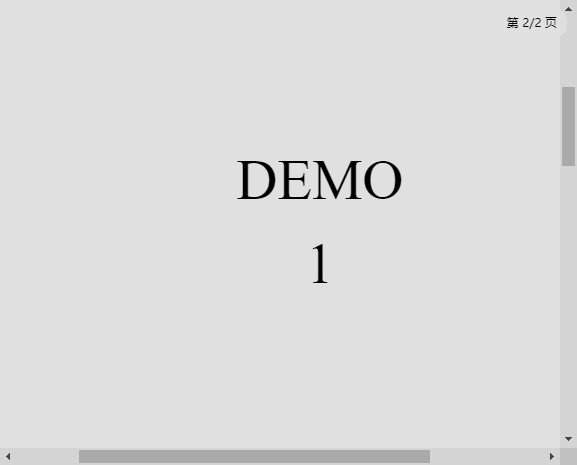

# SidePDF / 悬浮 PDF 阅读器

A minimal floating PDF reader built with **Electron + PDF.js**.  
一个基于 **Electron + PDF.js** 的极简悬浮 PDF 阅读器，支持贴边收纳与快速展开。

SidePDF is designed for reading PDFs in a small always-on-top window that can be docked to the screen edge and quickly revealed when needed.  
SidePDF 适合在工作/学习时把 PDF 以小窗口置顶显示，贴边收纳，鼠标靠近触发区即可快速展开查看。

---

## Preview / 演示截图

### Expanded View / 展开阅读


### Docked View / 贴边收纳


---

## Features / 功能特性

- 🪟 Always-on-top floating window / 置顶悬浮窗口
- 📌 Edge dock + auto hide/show / 贴边收纳与自动展开/收回
- 🖱️ Hover-to-reveal trigger zone / 鼠标触发区展开（减少误触）
- 🔍 PDF rendering powered by PDF.js / 基于 PDF.js 清晰渲染
- 📂 Open local PDFs / 支持打开本地 PDF（快捷键）
- ⚡ Lightweight & framework-free / 轻量、无前端框架依赖

---

## Project Structure / 项目结构（当前仓库）

> The viewer is served locally by an internal Express static server (started by Electron).  
> 查看器资源通过 Electron 内置的 Express 静态服务提供（启动程序时自动启动）。

```bash
SidePDF/
├─ pdf/            # Sample PDFs / 示例 PDF（可选）
├─ pdfjs/          # PDF.js distribution / pdf.js 与 worker 等文件
├─ viewer.html     # Viewer UI / 查看器页面
├─ viewer.js       # Viewer logic / 渲染逻辑
├─ main.js         # Electron main process / Electron 主进程
├─ package.json
├─ package-lock.json
├─ .gitignore
└─ README.md
```

---

## Quick Start / 快速开始

### 1) Clone / 克隆仓库

```bash
git clone https://github.com/138237/SidePDF.git
cd SidePDF
```

### 2) Install dependencies / 安装依赖

```bash
npm install
```

> Dependencies including `express` are already declared in `package.json`.  
> 项目依赖（包括 `express`）已在 `package.json` 中声明，无需额外安装。

### 3) Run / 启动

```bash
npm start
```

---

## Controls / 快捷键说明

> Hotkeys can be adjusted in `main.js`.

- **Ctrl + Alt + O** — Open local PDF / 打开本地 PDF
- **Ctrl + Alt + H** — Hide / Show window / 隐藏或显示窗口
- **Ctrl + Alt + T** — Toggle click-through / 切换鼠标穿透
- **Ctrl + Alt + Right** — Dock to right & auto hide / 贴右侧并收纳
- **Ctrl + Alt + Left** — Dock to left & auto hide / 贴左侧并收纳
- **Ctrl + Alt + M** — Toggle dock mode / 切换收纳模式
- **Ctrl + Alt + ↑ / ↓** — Adjust opacity / 调整透明度

### Interaction details / 交互细节

- When docked, the window reveals only when hovering near the trigger zone (to reduce accidental pop-ups).  
  收纳后，仅在鼠标靠近触发区时展开，减少误触。
- After hide / reveal, the window restores its last position / size / opacity.  
  展开/收回会恢复到收纳时的位置/大小/透明度。

---

## Notes / 说明

- This project currently targets Windows usage.  
  当前主要面向 Windows 使用场景。
- If you run into dependency download issues, ensure your network can access Electron download hosts.  
  如遇依赖下载问题，请确认网络可访问 Electron 相关下载源。

---

## Roadmap / 计划（可选）

- Drag & drop PDF / 拖拽打开 PDF
- Better file picker UX / 更完善的文件选择体验
- Packaging to exe (Windows) / 打包成 Windows 可执行程序

---

## License / 许可

MIT